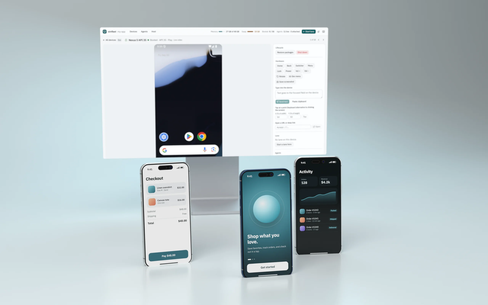

<h1 align="center">simfleet</h1>

<p align="center">
  <strong>One control plane for parallel React Native work on macOS.</strong><br>
  Slimmed iOS simulators and Android emulators, a live browser dashboard, leased Metro ports,<br>
  a shared native build cache, and per-agent device attribution for Claude Code and Codex.
</p>

<p align="center">
  <a href="https://github.com/entropyconquers/simfleet/actions/workflows/ci.yml"></a>
  <a href="https://www.npmjs.com/package/simfleet"></a>
  <a href="LICENSE"></a>
  
</p>

<p align="center">
  <a href="https://entropyconquers.github.io/simfleet/docs/"><strong>Documentation</strong></a> ·
  <a href="https://entropyconquers.github.io/simfleet/docs/quickstart/">Quickstart</a> ·
  <a href="https://entropyconquers.github.io/simfleet/docs/api-reference/">API reference</a>
</p>

<p align="center"></p>

---

Running several branches of a React Native app at once usually means five simulators eating 4 GB each,
Metro servers fighting over port 8081, native rebuilds every time you switch environments, and coding
agents stepping on each other's devices. simfleet turns that into one managed fleet:

- **Always slim.** Every iOS simulator is trimmed with [SimSlim](https://github.com/MobAI-App/simslim)
  (about 3.8 GB → 1.3 GB) and every Android emulator with
  [avdslim](https://github.com/kdbhalala/avdslim) (`-lowram`, host GPU, ~45 background packages
  disabled). Devices booted any other way (Xcode, Android Studio, `simctl`) are slimmed automatically.
- **One live dashboard.** Every booted device streams into a browser wall you can drive directly: iOS
  over MJPEG, Android as hardware H.264 through [scrcpy](https://github.com/Genymobile/scrcpy)'s device
  server with real touch down/move/up (15–80 ms input-to-frame on an M-series Mac).
- **Lanes, not port juggling.** A lane is one worktree on one device with one leased Metro port from the
  environment's range. Lanes refuse to steal a device, worktree, or port.
- **Native builds once.** An Expo `buildCacheProvider` fingerprints native inputs (JS excluded) and
  single-flights misses, so ten agents on JS-only branches share one build, and switching
  staging/production never rebuilds native.
- **Know which agent is where.** Every CLI call from a Claude Code or Codex session is attributed to the
  device it touches; sessions can claim devices. A menu-bar icon shows who is driving what.

## Requirements

- macOS, [Bun](https://bun.sh) ≥ 1.1
- iOS: Xcode, plus `brew install mobai-app/tap/simslim baguette watchman`
- Android: the Android SDK (platform-tools and emulator, via `ANDROID_HOME` or
  `~/Library/Android/sdk`), plus
  `brew tap kdbhalala/avdslim https://github.com/kdbhalala/avdslim.git && brew install avdslim scrcpy`

Each platform is optional; `simfleet status` and the dashboard report what is missing.

## Quick start

```bash
bun add -g simfleet               # or run any command with: bunx simfleet <command>
cd path/to/your-app
simfleet init                     # writes .sim-fleet/project.json; set your real bundle IDs/schemes
simfleet skill install            # optional: teach Claude Code and Codex to use the fleet
simfleet serve                    # dashboard + API on http://127.0.0.1:8790 and the menu-bar icon
```

Then, in another terminal (or from an agent):

```bash
simfleet sim list                                     # iOS simulators with slim state
simfleet sim boot <udid>                              # boots slim and verifies it
simfleet lane start "$PWD" <udid> development debug   # leases a Metro port, starts Metro
simfleet lane launch <lane-id>                        # opens the dev client at that Metro
```

Android works the same way with AVD names:

```bash
simfleet emu boot Pixel_8_API_35                      # headless, 2 GB guest RAM, slimmed
simfleet lane start "$PWD" Pixel_8_API_35             # adb reverse + dev-client deep link on launch
```

## Using the dashboard

Open http://127.0.0.1:8790 (or click the menu-bar icon). The wall shows every simulator and emulator
with state, memory footprint, slim status, lane, and attached agents. Open a device to control it:
click to tap, drag to swipe, scroll to scroll, press <kbd>Enter</kbd> to send keystrokes and
<kbd>Esc</kbd> to release. The inspector has lifecycle actions, hardware buttons, text entry, deep links,
and lane controls. The page follows the system light/dark theme, is keyboard and screen-reader
accessible, and reloads itself when the dashboard is upgraded.

The menu-bar icon starts with `simfleet serve` (disable with `--no-tray` or `SIM_FLEET_TRAY=0`) or on its
own with `simfleet tray`. Left-click opens the dashboard; right-click lists devices and their agents.
The helper is compiled from `tray/SimFleetTray.swift` with `swiftc` on first use and cached in
`~/Library/Caches/simfleet`.

## CLI

Run `simfleet help` for everything. The most used commands:

| Command | What it does |
| --- | --- |
| `simfleet serve [--no-tray]` | Dashboard, API, auto-slim loop, and menu-bar icon |
| `simfleet status` · `ports` · `agents` | Fleet state, Metro leases, live agent sessions |
| `simfleet sim boot\|slim\|restore\|shutdown <udid> [--stock]` | iOS lifecycle (slim by default) |
| `simfleet emu boot\|slim\|restore\|shutdown <avd> [--window] [--cold] [--stock]` | Android lifecycle |
| `simfleet sim\|emu ui <id> [x y]` | Accessibility / UIAutomator tree, or a hit test |
| `simfleet sim\|emu tap\|swipe\|type\|key\|button\|open-url <id> …` | Drive a device |
| `simfleet lane start <worktree> <device> [env] [debug\|release]` | Start a lane with a leased port |
| `simfleet lane launch\|open-url\|log\|stop <lane-id>` | Operate a lane |
| `simfleet native plan\|ensure …` | Inspect or fill the native build cache |
| `simfleet claim <device> [note]` · `release <device>` | Hold a device for this agent session |
| `simfleet worktree create <name> <branch>` | Create a worktree prepared for the fleet |
| `simfleet init` · `skill install` | Project config and agent skill setup |

Every command is a thin client over the local HTTP API; `GET /api/v1/capabilities` describes it, and
[`skills/simfleet/references/api.md`](skills/simfleet/references/api.md) documents it in full.

## Agent skill

simfleet ships an agent skill that teaches Claude Code and Codex to use the fleet correctly: boot devices
slim, claim what they hold, let lanes own ports, and prefer the JS-first path over native rebuilds.

```bash
simfleet skill install              # ~/.claude/skills/simfleet and ~/.codex/skills/simfleet
simfleet skill install --project    # ./.claude/skills and ./.codex/skills, to commit with your app
simfleet skill install --claude     # only Claude Code (or --codex for only Codex)
```

Re-run it after upgrading simfleet. The skill lives in [`skills/simfleet`](skills/simfleet) if you prefer
to copy or adapt it; list it under `worktrees.skills` in `project.json` so new worktrees link it too.

**Attribution.** The CLI reads `CLAUDE_CODE_SESSION_ID` or `CODEX_THREAD_ID` and sends it with every
device request, so the dashboard shows which session touched which device (touches expire after 30
minutes). Other agents can set `SIMFLEET_AGENT` and `SIMFLEET_SESSION_ID`, or send the
`x-simfleet-agent` / `x-simfleet-session` headers. `simfleet claim` attaches a session until it releases
the device or the Claude session exits.

To make every agent boot slim devices by default even outside simfleet projects, add a line like this
to `~/.claude/CLAUDE.md` or `~/.codex/AGENTS.md`:

```md
Boot iOS simulators and Android emulators slim unless I explicitly ask for stock: use
`simfleet sim boot` / `simfleet emu boot` in simfleet projects, otherwise `simslim on <udid>` and
`avdslim start <avd>`.
```

## Always slim

`sim boot` and `emu boot` apply and verify the slim profile, and `simfleet serve` checks every 15 seconds
for devices booted another way:

- **Android:** a running emulator without avdslim state is slimmed in place (no reboot).
- **iOS:** SimSlim needs a reboot, so a simulator is slimmed automatically only within its first 4
  minutes. An older unslimmed simulator is reported as `needs-reboot` (and shown as "Unslimmed" with a
  Slim button) rather than being interrupted mid-test.

Opt a device out with `--stock` on boot, or with `restore`; `slim` opts it back in. Disable auto-slim
entirely with `SIM_FLEET_AUTO_SLIM=0` or `"autoSlim": false`.

## Project configuration

simfleet runs against the nearest directory containing `.sim-fleet/project.json` and resolves linked Git
worktrees to their main checkout (override with `SIM_FLEET_PROJECT_ROOT`).

```jsonc
{
  "schemaVersion": 1,
  "projectName": "my-app",
  "nativeShells": {
    "debug":   { "appName": "My App Dev", "bundleId": "com.example.app.dev", "scheme": "myapp-dev" },
    "release": { "appName": "My App",     "bundleId": "com.example.app",     "scheme": "myapp",
                 "androidPackage": "com.example.app" }          // optional; defaults to bundleId
  },
  "environments": {                                             // non-overlapping Metro port ranges
    "development": { "envFile": ".env.development", "portRange": [8100, 8199] },
    "staging":     { "portRange": [8200, 8299] },
    "preprod":     { "portRange": [8300, 8399] },
    "production":  { "portRange": [8400, 8499] }
  },
  // Everything below is optional.
  "nativeAuth": { "provider": "your-auth-provider", "allowedAppIdentifiers": ["com.example.app.dev", "com.example.app"] },
  "simslimProfile": ".simslim/profile.json",
  "autoSlim": true,
  "stateDirectoryName": "My App Sim Fleet",                     // ~/Library/Application Support/<name>
  "cacheDirectoryName": "My App Sim Fleet",                     // ~/Library/Caches/<name>/native
  "appProcessNames": ["MyApp"],
  "metro": {                                                    // {environment} {mode} {port} templates
    "env": { "APP_ENV": "{environment}" },
    "modeEnv": { "debug": { "APP_VARIANT": "dev" }, "release": { "APP_VARIANT": "prod" } }
  },
  "release": { "entryFile": "index.ts" },
  "nativeFingerprint": { "localNativeDirectories": ["vendor/sdk/ios"], "localNativeFiles": [] },
  "worktrees": {
    "baseRef": "origin/main",
    "overlayFiles": ["metro.config.js"],
    "sharedPaths": [".sim-fleet", "node_modules"],
    "skills": [".claude/skills/simfleet"]
  },
  "android": { "avdslimArgs": ["--keep=com.google.android.apps.maps"] }
}
```

Only `projectName`, `nativeAuth`, and `nativeShells` feed the native fingerprint, so changing ports,
Metro env, or worktree settings never invalidates cached builds.

### Native build cache

Add simfleet to the app and point Expo's build cache at it:

```bash
bun add -d simfleet
```

```js
// app.config.js
module.exports = {
  expo: {
    experiments: {
      buildCacheProvider: { plugin: require.resolve("simfleet/build-cache") },
    },
  },
};
```

### Identity model

Bundle identifiers are stable native identities, never worktree identities. Isolation comes from one
device and one leased Metro port per lane. Environments are selected in JavaScript, so switching
staging/production never forces a native build. Android lanes are debug-only and reach Metro through
`adb reverse`.

## Environment variables

| Variable | Default | Purpose |
| --- | --- | --- |
| `SIM_FLEET_UI_PORT` | `8790` | Dashboard and API port (always bound to 127.0.0.1) |
| `SIM_FLEET_URL` | `http://127.0.0.1:8790` | Where the CLI, tray, and dashboard dev server find the API |
| `SIM_FLEET_PROJECT_ROOT` | nearest `.sim-fleet` | Project to serve |
| `SIM_FLEET_TRAY` | `1` | `0` disables the menu-bar icon |
| `SIM_FLEET_AUTO_SLIM` | `1` | `0` disables auto-slim |
| `SIM_FLEET_ANDROID_RAM_MB` | `2048` | Guest RAM for emulator boots (unless `avdslimArgs` sets `--ram=`) |
| `SIM_FLEET_METRO_WORKERS` | `1` | Metro `--max-workers` per lane |
| `AVDSLIM_BIN`, `ANDROID_HOME` | `PATH`, `~/Library/Android/sdk` | Android tool locations |
| `SCRCPY_SERVER_PATH`, `SCRCPY_SERVER_VERSION` | Homebrew scrcpy | scrcpy device server for live Android video |

## Security

The server binds to `127.0.0.1` only and has no authentication: anything running as your user can drive
your devices through it, exactly as it could with `xcrun simctl` or `adb`. Do not expose the port on a
network. See [SECURITY.md](SECURITY.md) to report a vulnerability.

## Development

```bash
git clone https://github.com/entropyconquers/simfleet && cd simfleet
bun install
bun run check                  # typecheck, tests, dashboard build
cd dashboard && bun run dev    # hot-reloading dashboard, proxied to a running `simfleet serve`
```

A git checkout builds the dashboard automatically on the first `simfleet serve`. The documentation site
lives in [`docs/`](docs) (Next.js + [unmint](https://github.com/gregce/unmint)); run `bun install && bun run dev`
there to preview it. See
[CONTRIBUTING.md](CONTRIBUTING.md) for the project layout and conventions.

## Acknowledgements

simfleet builds on [SimSlim](https://github.com/MobAI-App/simslim),
[Baguette](https://github.com/tddworks/baguette), [avdslim](https://github.com/kdbhalala/avdslim), and
[scrcpy](https://github.com/Genymobile/scrcpy). It invokes them as separate programs and does not
bundle their code.

## License

[MIT](LICENSE) © 2026 Vishesh Raheja
